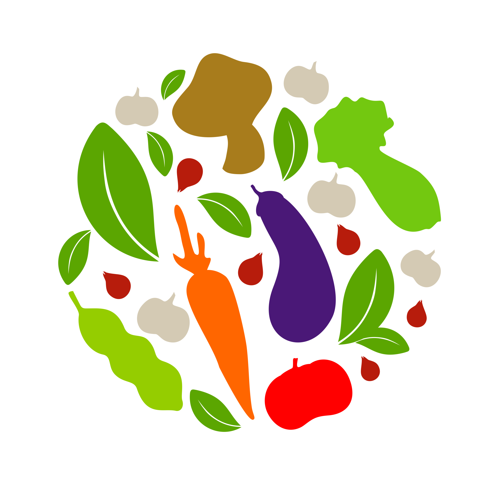
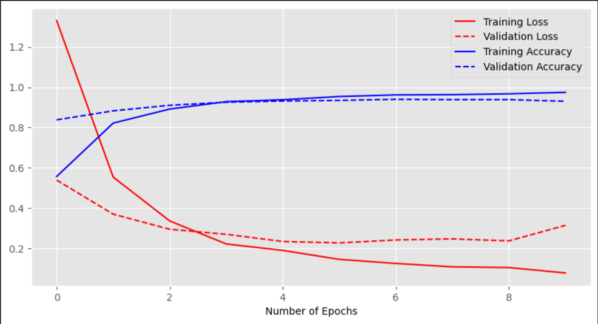

<br/>
<p align="center">
  <a href="https://github.com/ShaanCoding/ReadME-Generator">
    
    
  </a>

  <h3 align="center">Vegetable-Image-Classification-and-X-Ray-Images-Classification-using-CNN</h3>

  <p align="center">
    IMAGE CLASSIFICATION MODEL USING DEEP NEURAL NETWORKS 
    <br/>
    <br/>
    <a href="https://github.com/Arijeet04/Vegetable-Image-Classification-and-X-Ray-Images-Classification-using-CNN"><strong>»Explore the README</strong></a>
    <br/>
    <br/>
    <a href="https://github.com/Arijeet04/Vegetable-Image-Classification-and-X-Ray-Images-Classification-using-CNN">View Demo</a>
    .
    <a href="https://github.com/Arijeet04/Vegetable-Image-Classification-and-X-Ray-Images-Classification-using-CNN">Report Bug</a>
    .
    <a href="https://github.com/Arijeet04/Vegetable-Image-Classification-and-X-Ray-Images-Classification-using-CNN">Request Feature</a>
  </p>
</p>

    

## Table Of Contents

* [About the Project](#about-the-project)
* [Built With](#built-with)
* [Getting Started](#getting-started)
  * [Prerequisites](#prerequisites)
  * [Installation](#installation)
* [Usage](#usage)
* [Roadmap](#roadmap)
* [Contributing](#contributing)
* [License](#license)
* [Authors](#authors)
* [Acknowledgements](#acknowledgements)

## About The Project


Vegetable Image Classification :

From vegetable production to delivery, several common steps are operated manually. Like picking, and sorting vegetables. Therefore, we decided to solve this problem using deep neural architecture, by developing a model that can detect and classify vegetables. That model can be implemented in different types of devices and can also solve other problems related to the identification of vegetables, like labeling the vegetables automatically without any need for human work.



X-Ray-Images-Classification:

The normal chest X-ray (left panel) depicts clear lungs without any areas of abnormal opacification in the image. Bacterial pneumonia (middle) typically exhibits a focal lobar consolidation, in this case in the right upper lobe (white arrows), whereas viral pneumonia (right) manifests with a more diffuse ‘‘interstitial’’ pattern in both lungs. The dataset is organized into 3 folders (train, test, val) and contains subfolders for each image category (Pneumonia/Normal). There are 5,863 X-Ray images (JPEG) and 2 categories (Pneumonia/Normal). 

We will use CNN to achieve this task: 

Here's why:

 1) Dataset: In this dataset there are 21000 images from 15 classes, where each class contains a total of 1400 images. Each class has an equal proportion and image resolution is 224×224 and in *.jpg format. We split our dataset into three parts, where 70%(approx.) for training and 15%(approx.) for testing, and the rest 15%(approx.) for validation. 

 2) Process: Various image processing techniques are applied to the license plate image after identifying the plate. These include resizing, converting to grayscale, thresholding to create a binary image, erosion to remove boundary noise, dilation to fill absent pixels.CNN Model Creation: A Convolutional Neural Network (CNN) model is constructed for character recognition. The model comprises convolutional layers, max-pooling layers for downsampling, dropout layers for regularization, a flattening layer, and dense layers for classification. 

 3)  Training the CNN Model: The CNN model is trained using the extracted characters as a dataset. The training involves using the Keras ImageDataGenerator class to generate augmented data to improve the model’s generalization. Width and height shifts are applied to augment the training dataset


A list of commonly used resources that I find helpful are listed in the acknowledgements.

## Built With

Python,Tensorflow,CNN,Keras

## Getting Started

You just need to clone the repo and download the Dataset for classification

### Prerequisites

This is an example of how to list things you need to use the software and how to install them.

* npm

```sh
npm install npm@latest -g
```

### Installation

1. Get a free API Key at [https://example.com](https://example.com)

2. Clone the repo

```sh
git clone https://github.com/your_username_/Project-Name.git
```

3. Install NPM packages

```sh
npm install
```

4. Enter your API in `config.js`

```JS
const API_KEY = 'ENTER YOUR API';
```

## Usage

Use this space to show useful examples of how a project can be used. Additional screenshots, code examples and demos work well in this space. You may also link to more resources.

_For more examples, please refer to the [Documentation](https://example.com)_

## Roadmap

See the [open issues](https://github.com/ShaanCoding/ReadME-Generator/issues) for a list of proposed features (and known issues).

## Contributing

Contributions are what make the open source community such an amazing place to be learn, inspire, and create. Any contributions you make are **greatly appreciated**.
* If you have suggestions for adding or removing projects, feel free to [open an issue](https://github.com/ShaanCoding/ReadME-Generator/issues/new) to discuss it, or directly create a pull request after you edit the *README.md* file with necessary changes.
* Please make sure you check your spelling and grammar.
* Create individual PR for each suggestion.
* Please also read through the [Code Of Conduct](https://github.com/ShaanCoding/ReadME-Generator/blob/main/CODE_OF_CONDUCT.md) before posting your first idea as well.

### Creating A Pull Request

1. Fork the Project
2. Create your Feature Branch (`git checkout -b feature/AmazingFeature`)
3. Commit your Changes (`git commit -m 'Add some AmazingFeature'`)
4. Push to the Branch (`git push origin feature/AmazingFeature`)
5. Open a Pull Request

## License

Distributed under the MIT License. See [LICENSE](https://github.com/ShaanCoding/ReadME-Generator/blob/main/LICENSE.md) for more information.

## Authors

* **Shaan Khan** - *Comp Sci Student* - [Shaan Khan](https://github.com/ShaanCoding/) - *Built ReadME Template*

## Acknowledgements

* [ShaanCoding](https://github.com/ShaanCoding/)
* [Othneil Drew](https://github.com/othneildrew/Best-README-Template)
* [ImgShields](https://shields.io/)
